# 软件实现说明书

## 1、前后端技术选型

### 1.1 前后端技术选型介绍

#### 1.1.1前端技术选型

##### Vue3

Vue是一款用于构建用户界面的 JavaScript 框架。它基于标准 HTML、CSS 和 JavaScript 构建，并提供了一套声明式的、组件化的编程模型，帮助你高效地开发用户界面。无论是简单还是复杂的界面，Vue 都可以胜任。

Vue包括两个核心功能：

- **声明式渲染**：Vue 基于标准 HTML 拓展了一套模板语法，使得我们可以声明式地描述最终输出的 HTML 和 JavaScript 状态之间的关系。
- **响应性**：Vue 会自动跟踪 JavaScript 状态并在其发生变化时响应式地更新 DOM。

使用Vue可以帮助我们更加高效地构建我们的前端网页，并提高开发效率。

此外，我们还使用了Vue官方推荐的Vite作为项目的脚手架。

##### 组件库

根据我们的个性化需求，我们使用了多套组件库来美化我们的界面并提高开发效率，下面进行逐一介绍：

**View UI Plus**

View UI Plus 是 View Design 设计体系中基于 Vue.js 3 的一套 UI 组件库，主要用于企业级中后台系统。这套组件库提供了超过 80 个常用底层组件（如 Button、Input、DatePicker等）及业务组件（如 City、Auth、Login 等）。

**Vuetify3**

Vuetify 是一个基于 Vue.js 精心打造 UI 组件库，整套 UI 设计为 Material 风格。能够让没有任何设计技能的开发者创造出时尚的 Material 风格界面。

**Varlet**

Varlet 是一个基于 Vue3开发的 Material 风格移动端组件库，全面拥抱 Vue3 生态，由 varletjs 社区团队开发和维护。

**Apache ECharts**

ECharts 是一个基于 JavaScript 的开源可视化图表库， 它提供了开箱即用的 20 多种图表和十几种组件，并且支持各种图表以及组件的任意组合，能够通过数据集管理数据，支持数据过滤、聚类、回归，帮助实现同一份数据的多维度分析。

**TinyMce**

TinyMCE 是一个轻量级的，基于浏览器的，所见即所得编辑器，支持目前流行的各种浏览器，由 JavaScript 写成。它的配置灵活简单，功能全面丰富，非常适合用来作为项目的富文本编辑器。

##### 其他

**Axios**

Axios，是一个基于promise的网络请求库，作用于node.js和浏览器中，它是 isomorphic 的(即同一套代码可以运行在浏览器和node.js中)。在服务端它使用原生node.js http模块, 而在客户端 (浏览端) 则使用XMLHttpRequest。

#### 1.1.2后端技术选型

##### 语言：Java

JDK 18

##### web框架：Spring boot+MyBatis

##### 构建工具：Maven

##### 数据库：MYSQL

### 1.2 前端技术选型理由

首先，我们前端开发框架选择了Vue：

Vue.js是一套构建用户界面的渐进式框架。与其他重量级框架不同的是，Vue 采用自底向上增量开发的设计。Vue 的核心库只关注视图层，并且非常容易学习，非常容易与其它库或已有项目整合。另一方面，Vue 完全有能力驱动采用单文件组件和 Vue 生态系统支持的库开发的复杂单页应用。

Vue有如下几点优势

- 轻量级框架，简单易学好上手。
- 支持双向数据绑定
- 组件化，增加代码的复用性。
- 视图,数据,结构分离
- 虚拟DOM
- 与react而言,同样都是操作虚拟dom,就性能而言,vue存在很大的优势

接着，因为减小工作量，避免重复造轮子以及美化界面的需求，我们根据需要引入了一些组件库，他们都有以下特点：

- 丰富的组件和功能，满足绝大部分网站场景
- 开箱忌用，极大程度节省开发成本
- 友好的 API ，自由灵活地使用空间
- 细致、漂亮的 UI
- 可自定义主题

最后为了和后端通信，我们选择了最为主流的的Axios发送前端的网络请求。

### 1.3 后端技术选型理由

#### 1.3.1采用Java的理由

1. 历史和稳定性：Java是一门经过长期发展和广泛应用的编程语言。它有一个强大的生态系统和广泛的第三方库支持，已经在许多大型企业和项目中得到验证。
2. 平台无关性：Java具有平台无关性，可以在不同的操作系统上运行。通过Java虚拟机（JVM），Java程序可以在多个平台上保持一致的行为，这有助于提高开发的可移植性和部署的灵活性。
3. 强大的工具和框架支持：Java拥有丰富的开发工具和框架，可以加快开发速度。
4. 安全性：Java在安全性方面有很好的声誉。它提供了安全性相关的功能和机制，如字节码校验、安全管理器和加密算法库等，有助于保护应用程序免受潜在的安全威胁。
6. 社区支持：Java拥有庞大的社区支持，有许多活跃的开发者和专家共享他们的经验和知识。这意味着可以轻松找到解决方案、文档和支持资源。

#### 1.3.2 采用Spring Boot+MyBatis的理由

Spring Boot和MyBatis是一种常见的后端技术选型组合，它们在开发Java后端应用程序方面非常流行。

1. Spring Boot：Spring Boot是一个基于Spring框架的快速开发、简化配置的框架。它提供了自动配置、内嵌服务器、自动化构建等功能，使得开发者可以更快速地搭建和部署应用程序。Spring Boot也提供了很多开箱即用的特性和插件，使得开发过程更加简单和高效。

2. MyBatis：MyBatis是一个Java持久化框架，它通过提供SQL映射文件和注解来简化数据库访问操作。MyBatis将SQL语句与Java对象之间的映射工作交给开发者定义，提供了灵活性和可定制性。它还支持动态SQL和缓存等功能，可以有效地提高数据库访问性能。

使用Spring Boot和MyBatis的组合有以下优点：

- 快速开发：Spring Boot提供了自动配置和默认约定，简化了项目的配置和搭建过程，可以快速启动一个基于Spring的应用程序。同时，MyBatis通过SQL映射文件和注解，简化了数据库访问的操作。

- 灵活性：Spring Boot和MyBatis都具有高度的可定制性，开发者可以根据项目需求进行灵活的配置和扩展。

- 松耦合：Spring Boot和MyBatis之间的集成相对简单，它们之间的依赖关系可以通过配置文件进行管理，实现了组件之间的松耦合。

- 生态系统支持：Spring Boot和MyBatis都有庞大的社区支持和丰富的生态系统，可以轻松找到解决方案、文档和示例。

#### 1.3.3 Maven

采用Maven作为项目构建和依赖管理工具有以下好处和利益：

1. 依赖管理：Maven提供了强大的依赖管理功能。通过在项目的POM文件中声明依赖，Maven可以自动下载和管理这些依赖。它会根据依赖关系解析并下载所需的库，大大简化了依赖管理的过程。

2. 构建自动化：Maven提供了一套标准的构建生命周期和插件机制，使得构建过程可以自动化执行。通过简单的命令，可以执行诸如编译、测试、打包、部署等一系列构建任务。这大大减少了手动操作和人工错误的发生。

3. 一致性和可重复性：Maven定义了一套统一的构建生命周期和标准的目录结构，使得项目的构建过程具有一致性和可重复性。这使得团队成员能够更容易地理解和维护项目的结构和构建过程。

4. 多模块项目支持：Maven支持构建和管理多模块项目。通过将项目划分为模块，可以更好地组织和管理代码。模块之间可以定义依赖关系，使得模块的构建和测试可以独立进行，同时还能保持整体项目的一致性。

5. 中央仓库和私有仓库：Maven维护了一个中央仓库，其中包含了大量的开源库和插件。通过配置POM文件，Maven可以自动从中央仓库下载所需的依赖。此外，Maven还支持设置私有仓库，用于存储自己开发的库或第三方库。

6. 插件生态系统：Maven拥有丰富的插件生态系统，可以通过插件来扩展和定制构建过程。无论是使用官方插件还是第三方插件，都可以轻松地集成到Maven构建中，实现更多的功能和灵活性。

7. 跨平台和跨团队协作：由于Maven是基于Java开发的，因此它可以在不同的操作系统上运行，并且可以与不同的团队成员共享和协作。无论是开发、测试还是部署，团队成员都可以使用统一的构建工具和依赖管理系统。

总体而言，Maven提供了一种统一、自动化和可重复的项目构建和依赖管理解决方案，帮助开发团队更高效地开发和交付软件。它减少了手动配置和管理的工作量，提高了构建过程的可靠性和一致性，使团队成员能够专注于开发和功能实现。

#### 1.3.4 采用MySQL的理由：

1. 成熟和广泛应用：MySQL是一个成熟、稳定且广泛应用的关系型数据库管理系统。它已经在各种规模和类型的应用中得到验证，包括大型企业级应用、Web应用、移动应用等。
2. 开源和免费：MySQL是一个开源数据库管理系统，可以免费使用和修改。这使得它成为许多开发者和组织的首选，可以减少开发和运维成本。
3. 跨平台支持：MySQL可以在多个操作系统上运行，包括Windows、Linux、macOS等。这使得它非常适合在不同的开发和部署环境中使用，并能够与其他系统进行集成。
4. 高性能和可扩展性：MySQL具有优化的查询引擎和索引机制，可以提供高性能的数据读写能力。它还支持水平和垂直扩展，可以根据需求进行横向扩展或纵向扩展，以应对不断增长的数据量和并发请求。
5. 丰富的功能和工具支持：MySQL提供了许多功能和工具，如事务支持、备份和恢复、存储过程和触发器等。它还有许多可视化管理工具和命令行工具，可以方便地管理和维护数据库。
6. 可靠性和数据安全：MySQL具有可靠的数据持久性和数据安全特性。它支持事务和ACID（原子性、一致性、隔离性和持久性）属性，确保数据的完整性和一致性。此外，MySQL还提供了各种安全性功能，如访问控制、加密传输和数据备份等。
7. 社区支持和生态系统：MySQL拥有庞大的开发者社区和活跃的开源生态系统。这意味着可以轻松获得技术支持、文档和解决方案，同时可以从其他开发者的经验和贡献中受益。

## 2、软件实现基本思路

### 2.1 调研，完成需求文档

#### 2.1.1 系统实现的功能

**系统部分：**

- 展示内容正能量：用户发布不合规言论会被系统检测并驳回请求
- 用户登录检测：不允许用户异地登录，并定期检查用户登录信息的有效性
  

**访客：**
- 浏览教育资源：访客在系统中查看各种教育资源的列表及其基本信息。
- 注册用户：访客通过填写注册表格来注册成为该系统的用户。
- 登录：访客通过输入注册的邮箱和密码来登录，并转换为用户属性。
- 找回密码：访客可以在登陆界面向系统申请找回密码。

**用户：**
- 操作个人信息：用户可以查看或修改自己的个人信息
- 退出登录：用户可以点击“退出登录”来退出登录状态，并将属性切换为访客。
- 删除用户：用户可以选择注销自己的账户，之后需要重新注册。
- 浏览教育资源：用户可以浏览教育资源列表、查看教育资源的详细信息和教育资源下载记录。
- 操作教育资源：用户可以下载教育资源至本地。
- 上传教育资源：用户可以从本地向平台上传教育资源供其它用户浏览。
- 删除教育资源：用户可以删除自己的教育资源。
- 浏览帖子：用户可以浏览帖子并查看详情。
- 操作帖子：用户可以对帖子进行评论、点赞的操作。
- 发布帖子：用户可以发布帖子至讨论区。
- 删除帖子：用户可以删除自己发布的帖子。

**管理员：**
- 登录：通过对应的账号密码登入系统，并获得权限。
- 退出登录：管理员可以退出登陆状态并变成访客属性。
- 管理用户信息：管理员可以添加、删除、查看或修改用户的个人信息。
- 管理教育资源：管理员可以上传、删除或修改教育资源。
- 管理帖子：管理员可以浏览帖子并删除评论。
- 数据分析：管理员可以查看用户活跃度、资源下载量等数据。

#### 2.1.2 性能需求

**静态数值要求：**

- 支持的终端数量：应为$总用户数\times 每个用户的终端数$，本系统暂定面向学校开放，且实际上，并不是所有的学生都会第一时间注册并使用本平台，故总用户数很难在短时间内迅速增加并达到学校总人数，我们应当根据平台的推广情况适当增加或减少支持的终端数量，以此更高效的利用资源，故暂定总用户数为全校人数的30%。考虑到绝大多数同学不会同时登录多个终端，故假设每个用户的终端数为1.1，支持的终端数量约为$40000\times 30\% \times1 .1=13200$（此数据应当随总用户数变化而调整）。
- 支持的并发用户数：考虑到本平台的主要功能是学生间交流、分享学习经验和校园资讯，并发的用户量不会太多，一直在线的时间不会很长，且没有可预见的高峰期，因此将支持的最大并发用户数定为支持的终端数量的20%，即约为$13200\times20\%=2640$
- 要处理的信息数量和类型：由平台的性质决定，大多数信息类型为文本，少数为图片、音频和视频等

**动态数值需求**

- 响应处理时间：由本地机和服务器的运行速度决定
  -  对于95%的设备，应在3.0秒内完成页面切换。
  - 对于90%的翻页点击，应在2.0秒内完成新页面的加载。
  - 对于90%的页面更新（如发布新帖子，评论帖子，发布资源等），应在1s内处理
  - 对于95%的搜索，应在3s内返回搜索结果。
- 数据的上传和下载时间：数据转换和数据传输操作由网络状况和数据大小决定。


### 2.2 确定系统的运行环境

#### 2.2.1 硬件接口

- CPU：双核心及以上，支持多线程
- 硬盘：不少于500GB
- 电源：有内置电源及外置电源，外置电源能够保证突然断电时有足够时间保存数据。
- 显示器：无要求
- 操作系统：Windows 10 操作系统
- 硬盘 
- 磁带机和光刻机接口（考虑到数据库大量数据的备份要求）

#### 2.2.2 软件接口

- 操作系统：支持Windows、Linux等常用操作系统
- 数据库：MYSQL
- 工具：支持常用文件格式的解析、转换等。

#### 2.2.3 通讯接口

- 通信协议：TCP/IP

#### 2.2.4 编程语言

- 前端：Javascript, css, html
- 后端：Java, mysql

### 2.3 划分系统模块

该软件按照架构层次划分可以分为前端实现的“用户界面层”，后端实现的“控制器层”，“服务层”和“模型映射层”。用户界面层负责与用户交互，根据用户的需求向后端发起请求获取数据，并将结果展示给用户。控制器层主要负责接受前端发起的请求，并调用服务层提供的接口实现对应的业务逻辑。服务层主要的作用是调用模型映射层提供的对数据库进行增删改查的封装方法组合成一个完整的业务逻辑，并向控制层提供接口。“模型映射层”实现了对数据库的映射，封装了数据库的增删改查操作，并将获取到的结果封装为特定的实体类进行传递。在此过程中，服务层提供服务的过程中可能出现异常，此时抛出异常包中的特定异常实现异常处理。


### 2.4 用户界面设计

根据平台的用例描述以及每个用例的设计可以发现该软件系统需要有以下页面以支持用户和管理员的操作：

- 引导界面“Guide”，该页面作为平台的首页展现给访客/用户/管理，实现对用户的引导。
- 登陆界面“Login”，该页面的职责为帮助用户完成注册，登录和找回密码操作。
- 个人信息界面”UserInfo“，该页面用户可以查看自己的个人信息，并进行修改操作，同时也可以进行注销账号操作。


通过这三个页面，用户可以完成平台的注册登录，修改个人信息，以及找回密码。

为了实现用户的引导，本平台包含首页导航页以及导航栏，用户可以随时切换自己所在的页面：

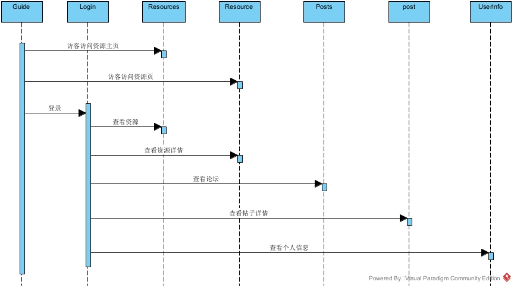

平台为了实现对于教育资源的查看、修改和管理，还需要以下页面：

- 教育资源详情页“ResourceDetail”，该页面的职责是展示教育资源的详细信息，上传资源，并允许用户对教育资源进行修改，删除和下载。

个人信息页面也负责展示当前用户的教育资源下载历史。

通过教育资源主页和以上几个页面，用户可以对平台的教育资源进行访问，发布，下载，修改和管理。


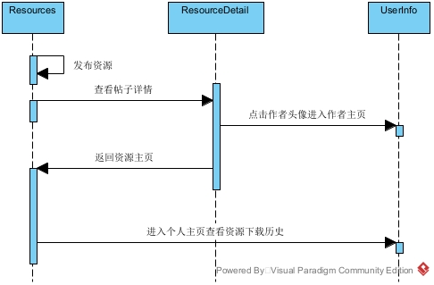

本平台为了实现帖子的查看、发布、修改和管理，还需要以下页面：

- 讨论区主页“Posts”，该页面用于显示目前讨论区的所有帖子，用户也可以在该页面进行帖子的发布和删除。
- 帖子详情界面“PostDetail”，用户可以在此界面查看帖子的具体内容，并对帖子进行点赞、评论、删除或删除评论。


最后，本平台为了实现管理员对平台的管理，还需要以下页面：

- 用户账号管理页面“UserManage”，管理员可以在本页查看、修改和删除所有用户的账号。
- 展示平台统计数据页面“Statistics”，管理员可以在此页面查看平台的所有统计数据。

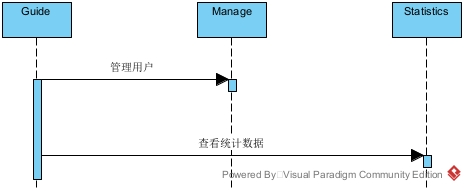

### 2.5 实现每个部分的功能及集成测试

（1） 编码实现每个类的功能

（2） 根据前面的设计，完成类之间的交互代码，实现系统所需要的功能

（3） 集成和测试，优化代码，修改bug

## 3、映射方法介绍

### 3.1 前端映射方法介绍

前端页面的实现依照《软件设计说明书》中“3.2 用户界面设计”部分而完成。按照界面设计的内容建立对应的页面，以提供相应的功能模块。

#### 导航页

导航页对应前端的`GuidePage.vue`和`MainView.vue`两个文件。

`MainView.vue`页面是所有页面的父页面，为所有页面提供上方的导航栏，以便于用户在页面之间进行切换。

`MainView.vue`为管理员提供了5个按钮，分别对应资源主页，帖子主页，用户管理页，统计数据页和登出。

```vue
<v-btn
color="#080202"
icon>
<v-icon title="资源主页" icon="mdi-package-variant" @click="navigateTo('/resources')"/>
</v-btn>

<v-btn
color="#080202"
icon>
<v-icon title="帖子主页" icon="mdi-post" @click="navigateTo('/posts')"/>
</v-btn>

<v-btn
color="#080202"
icon>
<v-icon title="用户管理页" icon="mdi-account-group-outline" @click="navigateTo('/manage')"/>
</v-btn>

<v-btn
color="#080202"
icon>
<v-icon title="统计数据页" icon="mdi-chart-line" @click="navigateTo('/statistics')"/>
</v-btn>

<v-btn color="#080202" @click="logout()">登出</v-btn>
```

`MainView.vue`为用户提供了4个按钮，分别对应资源主页，帖子主页，用户个人信息页，登出。

```vue
<v-avatar
variant="outlined"
style="margin-right: 10px;" @click="navigateToPersonality(userId)"
:image=Avatar
></v-avatar>

<v-btn
color="#080202"
icon>
<v-icon title="资源主页" icon="mdi-package-variant" @click="navigateTo('/resources')"/>
</v-btn>

<v-btn
color="#080202"
icon>
<v-icon title="帖子主页" icon="mdi-post" @click="navigateTo('/posts')"/>
</v-btn>

<v-btn
color="#080202"
icon>
<v-icon title="个人信息" icon="mdi-account-edit" @click="navigateToPersonality(userId)"/>
</v-btn>

<v-btn 
color="#080202"
@click="logout()">
登出
</v-btn>
```


#### 登录页

登录页对应前端的`LogRegView.vue`文件，这个页面提供了登录，注册和找回密码三个功能，分别对应该文件中三个方法：

| 方法名      | 作用                                       |
| ----------- | ------------------------------------------ |
| login       | 向后端发出登陆请求，后端校验后返回结果     |
| register    | 向后端发出注册请求，后端校验后返回结果     |
| getPassword | 向后端发出找回密码请求，后端校验后返回结果 |

#### 资源主页

资源主页对应`ResourcePage.vue`和`ResSummaryEntry.vue`文件，其中`ResSummaryEntry.vue`作为`ResourcePage.vue`的子组件显示一条条资源的简介。这个页面展示了所有的资源，并向用户提供了资源的筛选、搜索和上传功能，同时用户或管理员也可以对资源进行删除。

| 方法名          | 作用                               |
| --------------- | ---------------------------------- |
| getResourceList | 获取资源列表                       |
| uploadResource  | 用户上传资源                       |
| deleteResource  | 删除指定资源                       |
| openResource    | 进入指定资源详情页                 |
| SearchResource  | 搜索资源（通过学科，类别和关键词） |

#### 资源详情页

资源详情页对应`ResourceDetailPage.vue`文件，这个页面展示了资源的详细信息，用户可以在这个界面查看、下载、修改和删除资源，也可以通过点击作者头像的方式进入作者主页。

| 方法名            | 作用               |
| ----------------- | ------------------ |
| getResourceDetail | 获取资源详情       |
| modifyResource    | 修改资源           |
| deleteResource    | 删除资源           |
| downloadResource  | 下载资源           |
| jumpToPersonInfo  | 前往该用户个人主页 |

#### 帖子主页

帖子主页对应`PostPage.vue`和`PostSummaryEntry.vue`文件，其中`PostSummaryEntry.vue`作为`PostPage.vue`的子组件显示一条条帖子的简介。这个页面展示了所有的帖子，并向用户提供了当前论坛中的热帖。此外，用户可以通过不同的方式排序帖子，也可以发布新的帖子或删除帖子。

| 方法名      | 作用                 |
| ----------- | -------------------- |
| getPostList | 获取帖子列表         |
| getHotPosts | 获取热门帖子列表     |
| Post        | 发帖                 |
| deletePost  | 删除帖子             |
| openPost    | 进入指定帖子详情页   |
| ReorderPost | 通过不同方式排列帖子 |

#### 帖子详情页

资源详情页对应`PostDetailPage.vue`文件，这个页面展示了帖子的详细信息，包括所有的评论及其回复。

用户可以在这个界面浏览帖子的内容，进行点赞、评论或回复，也可以通过点击其他用户头像的方式进入其主页。

用户也可以删除自己发布的贴子，评论和回复。

| 方法名           | 作用               |
| ---------------- | ------------------ |
| getPostDetail    | 获取帖子详情       |
| makeComment      | 评论帖子           |
| makeReply        | 回复一条评论       |
| deletePost       | 删除帖子           |
| deleteComment    | 删除评论           |
| deleteReply      | 删除回复           |
| like             | 点赞               |
| jumpToPersonInfo | 前往该用户个人主页 |

#### 用户主页

登录页对应前端的`PersonalPage.vue`和`OthersPage`两个文件，这两个文件分别提供了用户对自己个人信息的访问和对他人个人信息的访问。在`PersonalPage.vue`页面中用户可以进行更改头像，修改个人信息，修改密码，注销账号等操作。

此外，`PersonalPage.vue`页面展示了用户的资源下载历史，而`OthersPage`页面展示了用户的上传资源和发帖历史。

| 方法名             | 作用                 |
| ------------------ | -------------------- |
| getInfo            | 获取用户个人信息     |
| updateUserInfo     | 修改用户个人信息     |
| updatePassword     | 修改用户密码         |
| deleteAccount      | 用户删除自己的账号   |
| getDownloadHistory | 获取用户下载历史     |
| getResourceHistory | 获取用户上传资源历史 |
| getPostHistory     | 获取用户发帖历史     |

#### 用户管理页

用户管理页对应前端的`ManageUserPage.vue`文件，这个页面为管理员提供了平台所有用户的信息，并允许管理员添加，删除用户，修改用户的信息和密码。

| 方法名          | 作用                 |
| --------------- | -------------------- |
| getUserInfoList | 获取所有用户个人信息 |
| updateUserInfo  | 修改用户个人信息     |
| updatePassword  | 修改用户密码         |
| deleteAccount   | 删除用户的账号       |
| addUser         | 添加用户             |

#### 统计数据页

统计数据页对应前端的`StatisticsPage.vue`文件，这个页面为管理员提供了平台的统计数据，包括用户，资源和帖子三部分的信息。

| 方法名                        | 作用                                   |
| ----------------------------- | -------------------------------------- |
| getOverall                    | 获取平台宏观数据，如用户总量，资源总量 |
| getRegLineChart               | 统计注册人数随时间的变化               |
| getResPieChart                | 统计不同学科资源的数量                 |
| getResBarChart                | 统计不同学科，类别资源的数量           |
| getResUploadDownloadLineChart | 统计资源上传下载量随时间的变化         |
| getPostScatterChart           | 统计不同时间帖子的热度等信息           |

### 3.2 后端映射方法介绍

#### 数据库实现

&emsp;&emsp;数据库的实现依照《软件设计说明书》中“3.5 数据设计”部分而完成。按照数据库设计的内容建表、添加字段，并且添加对应的外键及对应关系。数据库中所含表及其主键、外键列出如下：

| 表名            | 描述       | 主键 | 索引       |
| --------------- | ---------- | ---- | ---------- |
| User            | 用户信息   | id   |            |
| UserOnline | 当前在线用户   | id   | userId |
| Log             | 登录日志   | id   | userId     |
| Admin           | 管理员信息 | id   |            |
| Post            | 帖子       | id   | userId     |
| Like            | 点赞       | id   | postId, userId     |
| Comment         | 评论       | id   | postId, userId     |
| Reply           | 评论的回复 | id   | commentId, userId  |
| Resource        | 教育资源   | id   | userId     |
| ResourceCategories | 资源所属类别   | id   | resourceId |
| DownloadHistory | 下载记录   | id   | resourceId, userId |
| DownloadStatistic | 下载统计   | id   | resourceId, userId |
| Experience | 用户经验及等级信息   | id   | userId |

&emsp;&emsp;在实现过程中需要注意，由于多个表之间的存在着外键及引用关系，所以需要按照引用顺序建立不同的表。以上表格中的顺序就是一种可行的建表顺序。

&emsp;&emsp;下面给出其中一个表的建表语句，其余的表由于篇幅原因暂不在此展示，可以查看电子版完整代码获取。

```sql
CREATE TABLE `User` (
	id INT AUTO_INCREMENT PRIMARY KEY,
	`name` VARCHAR(20) DEFAULT NULL,
	`password` VARCHAR(255) NOT NULL,
	email VARCHAR(40) NOT NULL,
	gender ENUM('Male', 'Female', 'Helicopter') DEFAULT 'Helicopter',
	birthday DATE DEFAULT NULL,
	salt VARCHAR(20) NOT NULL,
	registerTime DATE DEFAULT NULL,
	profilePhotoUrl VARCHAR(255) DEFAULT NULL,
	LogInNum INT DEFAULT 0
) AUTO_INCREMENT = 10000001 CHARACTER SET utf8mb4 COLLATE utf8mb4_unicode_ci;
```

&emsp;&emsp;在建表时需要注意，由于本网站的受众大多使用汉语，所以表中存储内容需要支持汉语信息，因此编码格式应当使用utf8。

#### 实体类和异常类实现

&emsp;&emsp;实体类和异常类的实现在代码中对应着`model`包。而实体类主要分为返回值类、请求实体类和模型实体类等，它们的对应实现都在`model`包之下。

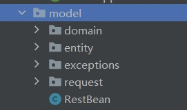

&emsp;&emsp;**数据实体类**对应着项目文件中的`domain`类，其中包括了和数据库中的表一一映射的各个类（具体可见“数据库实现”部分）和`enums`包，其中存放着一些枚举型数据库的字段的值。

&emsp;&emsp;**返回值类**对应着项目文件中的`RestBean`类，其中定义了返回值的状态码、是否成功以及返回信息为变量，还定义了`success`和`failure`两个函数，用于返回成功和失败的信息。

&emsp;&emsp;**请求实体类**对应着项目文件中的`request`包，其中包括了《软件设计说明书》中“3.4 类设计”中的请求实体类部分完成。为了保证代码的规范性、便于管理，在项目实现时，根据所处理的服务不同，将`request`包分为了`post`, `resource`, `user`三个子包。项目针对每一份请求都建立了一个实体类，其中包含了所要传递的变量属性。每个包包含的内容如下表所示：

**post:**
| 类名                          | 含义                   |
| ----------------------------- | ---------------------- |
| AddPostRequest                | 发布帖子请求           |
| ListPostRequest               | 获取帖子列表请求       |
| GetPostDetailRequest          | 获取帖子详情请求       |
| DeletePostRequest             | 删除帖子请求           |
| CommentPostRequest            | 评论帖子请求           |
| ListCommentRequest            | 显示评论请求           |
| ListReplyRequest              | 显示回复请求           |
| ReplyCommentRequest           | 回复评论请求           |
| DeletCommentRequest           | 删除评论请求           |
| DeleteReplyRequest            | 删除回复请求           |
| LikePostRequest               | 点赞帖子请求           |
| ListUserPostRequest               | 查看他人主页帖子请求           |

**resource:**

| 类名                          | 含义                   |
| ----------------------------- | ---------------------- |
| ListResourceByCategoryRequest | 按学科获取资源列表请求 |
| ListRecommendResoueceRequest  | 按推荐获取资源列表请求 |
| UploadResourceRequest         | 上传资源请求           |
| DownloadResourceRequest       | 下载资源请求           |
| GetResourceDetailRequest      | 查看资源详细信息请求    |
| SearchResourceRequest         | 搜索资源请求           |
| UpdateResourceRequest         | 更新资源内容请求           |
| DeleteResourceRequest         | 删除资源请求           |
| GetDownloadHistoryRequest     | 获取下载历史请求       |
| DeleteDownloadHistoryRequest  | 清空下载历史请求       |

**user:**

| 类名                          | 含义                   |
| ----------------------------- | ---------------------- |
| VerifyUserLoginRequest        | 验证用户登录请求       |
| VerifyAdminLoginRequest       | 验证管理员登录请求     |
| VerifyUserRegisterRequest     | 验证用户注册请求       |
| GetAccountInfoListRequest     | 获取用户列表请求       |
| UpdateAccountInfoRequest      | 更新用户数据请求       |
| GetPasswordRequest            | 找回密码请求           |
| UpdatePasswordRequest         | 更改密码请求           |
| DeleteAccountRequest          | 删除用户账户请求       |
| GetSaltRequest          		| 获取盐值加密请求       |

&emsp;&emsp;**模型实体类**对应着项目文件中的`entity`包，其中存放着与前端交互、传递信息的各个类。由于具体编码过程中的需要，在《软件设计说明书》中“3.4 类设计”中的模型实体类的基础上增加了一些实体类，具体可见下图：

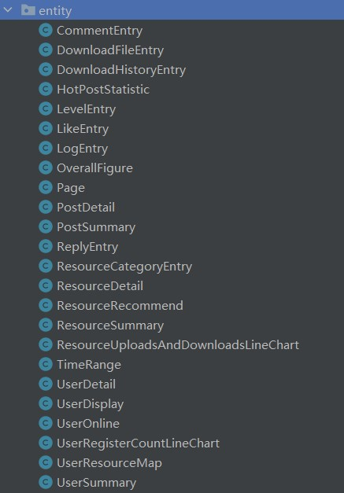

&emsp;&emsp;**异常处理类**对应着项目文件中的`exceptions`包，其中存放着不同类操作的异常处理操作函数，每一类的异常处理在项目文件中对应着每一个类。对应着《软件设计说明书》中“3.4 类设计”中的异常类，项目文件中异常类的具体分类可见下图：

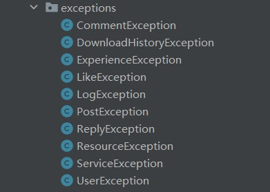

#### 功能类实现

&emsp;&emsp;功能类是项目实现中，主要负责完成前后端交互、对数据库进行操作和实现逻辑功能的主要类。由于采用了`springMVC`架构，所以按照《软件设计说明书》中“3.4 类设计”中的功能类设计，首先将功能类分为“拦截器层”、“控制器层”，“服务层”和“模型映射层”四个部分，它们在项目实现中分别对应了`interceptors`,`controller`,`service`,`mapper`四个包，即下图中选中的部分。

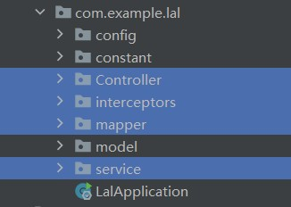

下面分别介绍四个部分的具体实现。

##### 拦截器层实现

由于拦截器层负责拦截token并检验，所以是可以适配所有方法的一个类，因此`interceptors`包中只有`JWTInterceptor`一个类，用来实现对不同方法对应的网址的拦截识别。当然，由于某些方法对所有使用者都适用，不需要进行拦截，那么就需要将其在配置文件中特殊标注，绕过拦截器。相关的配置文件内容在`config`包中的`InterceptorConfig`，配置内容示例如下：

```java
@Configuration
public class InterceptorConfig implements WebMvcConfigurer {
    @Override
    public void addInterceptors(InterceptorRegistry registry) {
        registry.addInterceptor(new JWTInterceptor())
                //拦截的路径
                .addPathPatterns("/user/*",
                        "/post/*",
                        "/resource/*",
                        "/statistic/*")

                //排除接口
                .excludePathPatterns("/user/getSalt",
                        "/user/hello",
                        "/user/login",
                        "/user/register",
                        "/user/adminLogin",
                        "/user/getPwd",
                        "/post/getUserPost"
                        "/resource/getResDetail",
                        "/resource/listResByClassWithPage",
                        "/resource/searchResource");
    }
}
```

##### 控制器层实现

&emsp;&emsp;控制器层主要和前端对接，因此主要是按用户功能界面进行划分。依照《软件设计说明书》中的内容，将`controller`包中分为如下5个类，介绍如下：

- UserController类： 负责处理和用户有关的请求，包括用户和管理员增删改查的需求。
- PostController类： 负责处理和帖子有关的请求，包括帖子、评论和回复增删改查的需求。
- ResourceController类： 负责处理和资源有关的请求，包括资源的增删改查、下载等功能的需求。
- StatisticController类： 负责处理和统计数据有关的请求，包括处理有关日志、资源下载量等数据的需求。
- ConsoleController类： 负责处理和命令行操作有关的请求，包括管理员的添加和重置邮箱操作。

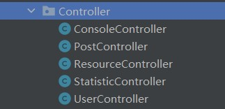

##### 服务层实现

&emsp;&emsp;服务层主要供`controller`层调用，并将参数传递给底层的`mapper`，对数据库进行操作。在代码实现中，`service`包中由每一个`service`类和一个`Impl`包构成。`service`包下的类主要是抽象类，用来提供接口，对应具体的函数实现则放在`Impl`包下的每个函数中。具体如下图：

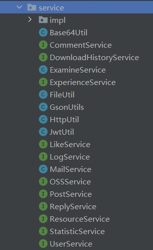

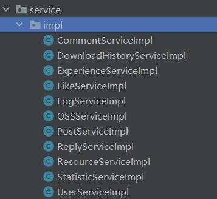

##### 模型映射层实现

模型映射层主要是对于数据库的操作，因此一个`mapper`对应着一张数据库的表，在项目实现中，也就对应着一个`model`包中`domain`中的一个类。具体含有的类如下图：

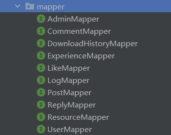

#### 辅助类实现

&emsp;&emsp;辅助类是在实现项目过程中，为了保证文件的结构性和规范性，所定义的一些常量集合类，在项目文件中，它们被放在`constant`包下，项目中所用到的常量都按照服务分类放在其中，具体包含`ExpConstants`, `OtherConstants`和`UserConstants`。

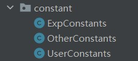

## 4、重点算法实现

### 4.1 在线用户实时检测

利用token进行用户身份验证的流程：

1. 客户端使用用户名和密码请求登录
2. 服务端收到请求，验证用户名和密码
3. 验证成功后，服务端会签发一个token，然后将此用户加入在线用户列表，再把这个token返回给客户端
4. 客户端收到token后可以把它存储起来
5. 客户端每次向服务端请求资源时需要携带服务端签发的token，在header中携带服务端收到的请求，然后去验证客户端请求里面带着的token，如果验证成功，就向客户端返回请求数据

​		但是token的有效期是静态的，为了保持用户的登陆状态，网页端每隔一段时间回想服务端发送一个心跳请求（heartbeat），服务器将验证这个token，如果这个token即将过期，服务器端则会向网页端签发一个新的token，并更新在线用户列表中对应用户的token，通过这种设计，维持了用户的登陆状态。

​		服务端每隔一段时间会扫描在线用户列表，检验每名在线用户的token，如果过期，意味着用户没有向我们发送心跳请求，可以认为他已下线，将此用户从在线用户列表中删除。当收到登出请求时，服务端也会将此用户从在线用户列表中删除，用户下线。

### 4.2 资源推荐算法

​		使用基于用户的协同推荐算法进行教育资源的推荐。

步骤如下：

- 根据下载记录，找到与当前用户A相似的用户B；
- 将相似用户B下载的资源而用户A没有下载的资源推荐给用户A。

相似度计算：

- 采用余弦相似度。余弦相似度衡量了用户向量**i**和用户向量**j**之间的向量夹角大小。显然，夹角越小，证明余弦相似度越大，两个用户越相似。