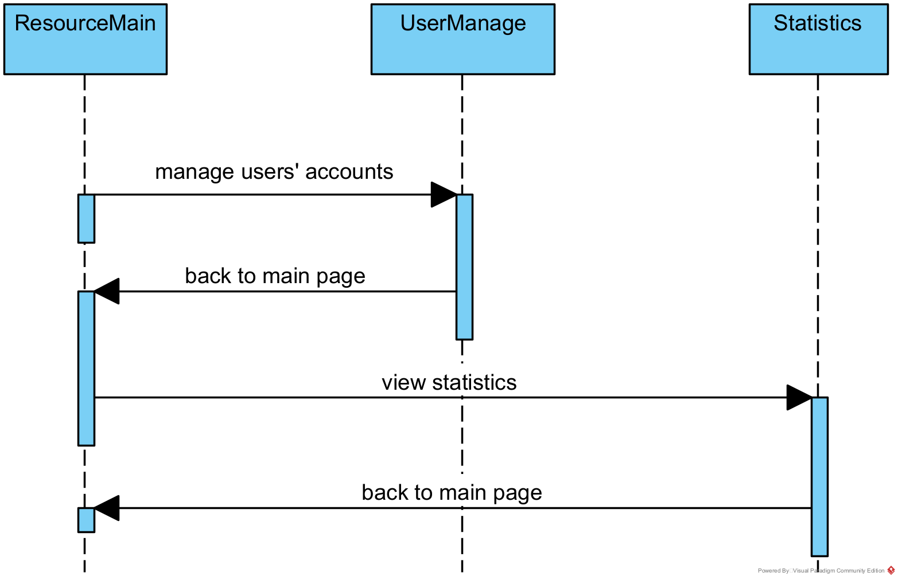

# 软件实现说明书

## 1、前后端技术选型

### 1.1 前后端技术选型介绍

### 1.2 前端技术选型理由

### 1.3 后端技术选型理由

## 2、软件实现基本思路

### 2.1 调研，完成需求文档

#### 2.1.1 系统实现的功能

**系统部分：**

- 展示内容正能量：用户发布不合规言论会被系统检测并驳回请求
- 用户登录检测：不允许用户异地登录，并定期检查用户登录信息的有效性
  
**访客：**
- 浏览教育资源：访客在系统中查看各种教育资源的列表及其基本信息。
- 注册用户：访客通过填写注册表格来注册成为该系统的用户。
- 登录：访客通过输入注册的邮箱和密码来登录，并转换为用户属性。
- 找回密码：访客可以在登陆界面向系统申请找回密码。

**用户：**
- 操作个人信息：用户可以查看或修改自己的个人信息
- 退出登录：用户可以点击“退出登录”来退出登录状态，并将属性切换为访客。
- 删除用户：用户可以选择注销自己的账户，之后需要重新注册。
- 浏览教育资源：用户可以浏览教育资源列表、查看教育资源的详细信息和教育资源下载记录。
- 操作教育资源：用户可以下载教育资源至本地。
- 上传教育资源：用户可以从本地向平台上传教育资源供其它用户浏览。
- 删除教育资源：用户可以删除自己的教育资源。
- 浏览帖子：用户可以浏览帖子并查看详情。
- 操作帖子：用户可以对帖子进行评论、点赞的操作。
- 发布帖子：用户可以发布帖子至讨论区。
- 删除帖子：用户可以删除自己发布的帖子。

**管理员：**
- 登录：通过对应的账号密码登入系统，并获得权限。
- 退出登录：管理员可以退出登陆状态并变成访客属性。
- 管理用户信息：管理员可以添加、删除、查看或修改用户的个人信息。
- 管理教育资源：管理员可以上传、删除或修改教育资源。
- 管理帖子：管理员可以浏览帖子并删除评论。
- 数据分析：管理员可以查看用户活跃度、资源下载量等数据。

#### 2.1.2 性能需求

**静态数值要求：**

- 支持的终端数量：应为$总用户数\times 每个用户的终端数$，本系统暂定面向学校开放，且实际上，并不是所有的学生都会第一时间注册并使用本平台，故总用户数很难在短时间内迅速增加并达到学校总人数，我们应当根据平台的推广情况适当增加或减少支持的终端数量，以此更高效的利用资源，故暂定总用户数为全校人数的30%。考虑到绝大多数同学不会同时登录多个终端，故假设每个用户的终端数为1.1，支持的终端数量约为$40000\times 30\% \times1 .1=13200$（此数据应当随总用户数变化而调整）。
- 支持的并发用户数：考虑到本平台的主要功能是学生间交流、分享学习经验和校园资讯，并发的用户量不会太多，一直在线的时间不会很长，且没有可预见的高峰期，因此将支持的最大并发用户数定为支持的终端数量的20%，即约为$13200\times20\%=2640$
- 要处理的信息数量和类型：由平台的性质决定，大多数信息类型为文本，少数为图片、音频和视频等

**动态数值需求**

- 响应处理时间：由本地机和服务器的运行速度决定
  -  对于95%的设备，应在3.0秒内完成页面切换。
  - 对于90%的翻页点击，应在2.0秒内完成新页面的加载。
  - 对于90%的页面更新（如发布新帖子，评论帖子，发布资源等），应在1s内处理
  - 对于95%的搜索，应在3s内返回搜索结果。
- 数据的上传和下载时间：数据转换和数据传输操作由网络状况和数据大小决定。


### 2.2 确定系统的运行环境

#### 2.2.1 硬件接口

- CPU：双核心及以上，支持多线程
- 硬盘：不少于500GB
- 电源：有内置电源及外置电源，外置电源能够保证突然断电时有足够时间保存数据。
- 显示器：无要求
- 操作系统：Windows 10 操作系统
- 硬盘 
- 磁带机和光刻机接口（考虑到数据库大量数据的备份要求）

#### 2.2.2 软件接口

- 操作系统：支持Windows、Linux等常用操作系统
- 数据库：MYSQL
- 工具：支持常用文件格式的解析、转换等。

#### 2.2.3 通讯接口

- 通信协议：TCP/IP

#### 2.2.4 编程语言

- 前端：Javascript, css, html
- 后端：Java, mysql

### 2.3 划分系统模块

该软件按照架构层次划分可以分为前端实现的“用户界面层”，后端实现的“控制器层”，“服务层”和“模型映射层”。用户界面层负责与用户交互，根据用户的需求向后端发起请求获取数据，并将结果展示给用户。控制器层主要负责接受前端发起的请求，并调用服务层提供的接口实现对应的业务逻辑。服务层主要的作用是调用模型映射层提供的对数据库进行增删改查的封装方法组合成一个完整的业务逻辑，并向控制层提供接口。“模型映射层”实现了对数据库的映射，封装了数据库的增删改查操作，并将获取到的结果封装为特定的实体类进行传递。在此过程中，服务层提供服务的过程中可能出现异常，此时抛出异常包中的特定异常实现异常处理。


### 2.4 用户界面设计

根据平台的用例描述以及每个用例的设计可以发现该软件系统需要有以下页面以支持用户和管理员的操作：

- 资源列表界面“ResourceMain”，该页面作为平台的首页展现给访客/用户/管理，同时也承担了查看教育资源的任务。
- 登陆界面“Login”，该页面的职责为帮助用户完成登录操作。
- 注册界面“Register”，该页面的职责为帮助用户完成注册操作。

通过这三个页面，用户可以完成平台的登录和注册。


本平台为了实现对于教育资源的查看、修改和管理，还需要以下页面：

- 教育资源详情页“ResourceDetail”，该页面的职责是展示教育资源的详细信息，并允许用户对教育资源进行修改，删除和下载。
- 发布新教育资源页面“AddResource”，用户将欲上传到平台教育资源的详细信息填写在此页面，并进行发布。
- 教育资源下载历史页面“DownloadHistory”，该页面展示当前用户的教育资源下载历史。

通过教育资源主页和以上三个页面，用户可以对平台的教育资源进行访问，发布，下载，修改和管理。


本平台为了实现帖子的查看、发布、修改和管理，还需要以下页面：

- 讨论区主页“PostMain”，该页面用于显示目前讨论区的所有帖子，用户也可以在该页面进行帖子的发布和删除。
- 发布帖子页面“AddPost”，用户将欲发布帖子的详细信息填写在此页面，并进行发布。
- 帖子详情界面“PostDetail”，用户可以在此界面查看帖子的具体内容，并对帖子进行点赞、评论、删除或删除评论。


本平台为了实现用户对自身账号的管理，还需要以下页面：

- 查看个人信息页面“PersonalInfo”，用户可以在该页面查看和编辑自己的账号信息，或者注销自己的账号。


最后，本平台为了实现管理员对平台的管理，还需要以下页面：

- 用户账号管理页面“UserManage”，管理员可以在本页查看、修改和删除所有用户的账号。
- 展示平台统计数据页面“Statistics”，管理员可以在此页面查看平台的所有统计数据。




### 2.5 实现每个部分的功能及集成测试

    （1） 编码实现每个类的功能

    （2） 根据前面的设计，完成类之间的交互代码，实现系统所需要的功能

    （3） 集成和测试，优化代码，修改bug

## 3、映射方法介绍

### 3.1 前端映射方法介绍

### 3.2 后端映射方法介绍

#### 数据库实现

&emsp;&emsp;数据库的实现依照《软件设计说明书》中“3.5 数据设计”部分而完成。按照数据库设计的内容建表、添加字段，并且添加对应的外键及对应关系。数据库中所含表及其主键、外键列出如下：

| 表名            | 描述       | 主键 | 索引       |
| --------------- | ---------- | ---- | ---------- |
| User            | 用户信息   | id   |            |
| UserOnline | 当前在线用户   | id   | userId |
| Log             | 登录日志   | id   | userId     |
| Admin           | 管理员信息 | id   |            |
| Post            | 帖子       | id   | userId     |
| Like            | 点赞       | id   | postId, userId     |
| Comment         | 评论       | id   | postId, userId     |
| Reply           | 评论的回复 | id   | commentId, userId  |
| Resource        | 教育资源   | id   | userId     |
| ResourceCategories | 资源所属类别   | id   | resourceId |
| DownloadHistory | 下载记录   | id   | resourceId, userId |
| DownloadStatistic | 下载统计   | id   | resourceId, userId |
| Experience | 用户经验及等级信息   | id   | userId |

&emsp;&emsp;在实现过程中需要注意，由于多个表之间的存在着外键及引用关系，所以需要按照引用顺序建立不同的表。以上表格中的顺序就是一种可行的建表顺序。

&emsp;&emsp;下面给出其中一个表的建表语句，其余的表由于篇幅原因暂不在此展示，可以查看电子版完整代码获取。

```sql
CREATE TABLE `User` (
	id INT AUTO_INCREMENT PRIMARY KEY,
	`name` VARCHAR(20) DEFAULT NULL,
	`password` VARCHAR(255) NOT NULL,
	email VARCHAR(40) NOT NULL,
	gender ENUM('Male', 'Female', 'Helicopter') DEFAULT 'Helicopter',
	birthday DATE DEFAULT NULL,
	salt VARCHAR(20) NOT NULL,
	registerTime DATE DEFAULT NULL,
	profilePhotoUrl VARCHAR(255) DEFAULT NULL,
	LogInNum INT DEFAULT 0
) AUTO_INCREMENT = 10000001 CHARACTER SET utf8mb4 COLLATE utf8mb4_unicode_ci;
```

&emsp;&emsp;在建表时需要注意，由于本网站的受众大多使用汉语，所以表中存储内容需要支持汉语信息，因此编码格式应当使用utf8。

#### 实体类和异常类实现

&emsp;&emsp;实体类和异常类的实现在代码中对应着`model`包。而实体类主要分为返回值类、请求实体类和模型实体类等，它们的对应实现都在`model`包之下。


&emsp;&emsp;**数据实体类**对应着项目文件中的`domain`类，其中包括了和数据库中的表一一映射的各个类（具体可见“数据库实现”部分）和`enums`包，其中存放着一些枚举型数据库的字段的值。

&emsp;&emsp;**返回值类**对应着项目文件中的`RestBean`类，其中定义了返回值的状态码、是否成功以及返回信息为变量，还定义了`success`和`failure`两个函数，用于返回成功和失败的信息。

&emsp;&emsp;**请求实体类**对应着项目文件中的`request`包，其中包括了《软件设计说明书》中“3.4 类设计”中的请求实体类部分完成。为了保证代码的规范性、便于管理，在项目实现时，根据所处理的服务不同，将`request`包分为了`post`, `resource`, `user`三个子包。项目针对每一份请求都建立了一个实体类，其中包含了所要传递的变量属性。每个包包含的内容如下表所示：

**post:**
| 类名                          | 含义                   |
| ----------------------------- | ---------------------- |
| AddPostRequest                | 发布帖子请求           |
| ListPostRequest               | 获取帖子列表请求       |
| GetPostDetailRequest          | 获取帖子详情请求       |
| DeletePostRequest             | 删除帖子请求           |
| CommentPostRequest            | 评论帖子请求           |
| ListCommentRequest            | 显示评论请求           |
| ListReplyRequest              | 显示回复请求           |
| ReplyCommentRequest           | 回复评论请求           |
| DeletCommentRequest           | 删除评论请求           |
| DeleteReplyRequest            | 删除回复请求           |
| LikePostRequest               | 点赞帖子请求           |
| ListUserPostRequest               | 查看他人主页帖子请求           |

**resource:**

| 类名                          | 含义                   |
| ----------------------------- | ---------------------- |
| ListResourceByCategoryRequest | 按学科获取资源列表请求 |
| ListRecommendResoueceRequest  | 按推荐获取资源列表请求 |
| UploadResourceRequest         | 上传资源请求           |
| DownloadResourceRequest       | 下载资源请求           |
| GetResourceDetailRequest      | 查看资源详细信息请求    |
| SearchResourceRequest         | 搜索资源请求           |
| UpdateResourceRequest         | 更新资源内容请求           |
| DeleteResourceRequest         | 删除资源请求           |
| GetDownloadHistoryRequest     | 获取下载历史请求       |
| DeleteDownloadHistoryRequest  | 清空下载历史请求       |

**user:**

| 类名                          | 含义                   |
| ----------------------------- | ---------------------- |
| VerifyUserLoginRequest        | 验证用户登录请求       |
| VerifyAdminLoginRequest       | 验证管理员登录请求     |
| VerifyUserRegisterRequest     | 验证用户注册请求       |
| GetAccountInfoListRequest     | 获取用户列表请求       |
| UpdateAccountInfoRequest      | 更新用户数据请求       |
| GetPasswordRequest            | 找回密码请求           |
| UpdatePasswordRequest         | 更改密码请求           |
| DeleteAccountRequest          | 删除用户账户请求       |
| GetSaltRequest          		| 获取盐值加密请求       |

&emsp;&emsp;**模型实体类**对应着项目文件中的`entity`包，其中存放着与前端交互、传递信息的各个类。由于具体编码过程中的需要，在《软件设计说明书》中“3.4 类设计”中的模型实体类的基础上增加了一些实体类，具体可见下图：


&emsp;&emsp;**异常处理类**对应着项目文件中的`exceptions`包，其中存放着不同类操作的异常处理操作函数，每一类的异常处理在项目文件中对应着每一个类。对应着《软件设计说明书》中“3.4 类设计”中的异常类，项目文件中异常类的具体分类可见下图：


#### 功能类实现

&emsp;&emsp;功能类是项目实现中，主要负责完成前后端交互、对数据库进行操作和实现逻辑功能的主要类。由于采用了`springMVC`架构，所以按照《软件设计说明书》中“3.4 类设计”中的功能类设计，首先将功能类分为“拦截器层”、“控制器层”，“服务层”和“模型映射层”四个部分，它们在项目实现中分别对应了`interceptors`,`controller`,`service`,`mapper`四个包，即下图中选中的部分。


下面分别介绍四个部分的具体实现。

##### 拦截器层实现

由于拦截器层负责拦截token并检验，所以是可以适配所有方法的一个类，因此`interceptors`包中只有`JWTInterceptor`一个类，用来实现对不同方法对应的网址的拦截识别。当然，由于某些方法对所有使用者都适用，不需要进行拦截，那么就需要将其在配置文件中特殊标注，绕过拦截器。相关的配置文件内容在`config`包中的`InterceptorConfig`，配置内容示例如下：

```java
@Configuration
public class InterceptorConfig implements WebMvcConfigurer {
    @Override
    public void addInterceptors(InterceptorRegistry registry) {
        registry.addInterceptor(new JWTInterceptor())
                //拦截的路径
                .addPathPatterns("/user/*",
                        "/post/*",
                        "/resource/*",
                        "/statistic/*")

                //排除接口
                .excludePathPatterns("/user/getSalt",
                        "/user/hello",
                        "/user/login",
                        "/user/register",
                        "/user/adminLogin",
                        "/user/getPwd",
                        "/post/getUserPost"
                        "/resource/getResDetail",
                        "/resource/listResByClassWithPage",
                        "/resource/searchResource");
    }
}
```

##### 控制器层实现

&emsp;&emsp;控制器层主要和前端对接，因此主要是按用户功能界面进行划分。依照《软件设计说明书》中的内容，将`controller`包中分为如下5个类，介绍如下：

- UserController类： 负责处理和用户有关的请求，包括用户和管理员增删改查的需求。
- PostController类： 负责处理和帖子有关的请求，包括帖子、评论和回复增删改查的需求。
- ResourceController类： 负责处理和资源有关的请求，包括资源的增删改查、下载等功能的需求。
- StatisticController类： 负责处理和统计数据有关的请求，包括处理有关日志、资源下载量等数据的需求。
- ConsoleController类： 负责处理和命令行操作有关的请求，包括管理员的添加和重置邮箱操作。


##### 服务层实现

&emsp;&emsp;服务层主要供`controller`层调用，并将参数传递给底层的`mapper`，对数据库进行操作。在代码实现中，`service`包中由每一个`service`类和一个`Impl`包构成。`service`包下的类主要是抽象类，用来提供接口，对应具体的函数实现则放在`Impl`包下的每个函数中。具体如下图：


##### 模型映射层实现

模型映射层主要是对于数据库的操作，因此一个`mapper`对应着一张数据库的表，在项目实现中，也就对应着一个`model`包中`domain`中的一个类。具体含有的类如下图：


#### 辅助类实现

&emsp;&emsp;辅助类是在实现项目过程中，为了保证文件的结构性和规范性，所定义的一些常量集合类，在项目文件中，它们被放在`constant`包下，项目中所用到的常量都按照服务分类放在其中，具体包含`ExpConstants`, `OtherConstants`和`UserConstants`。

