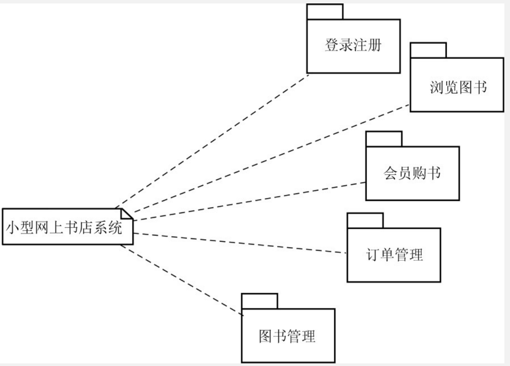
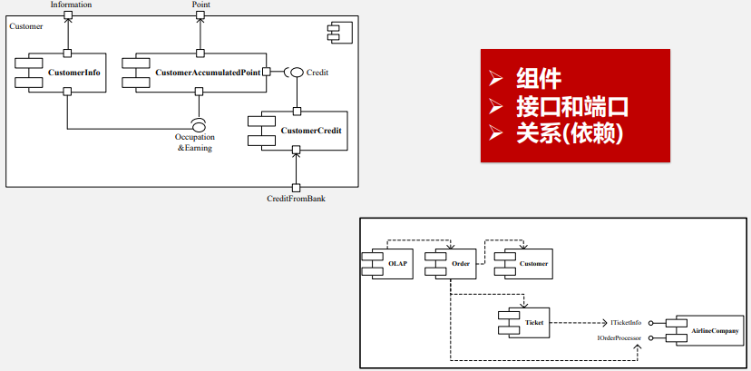
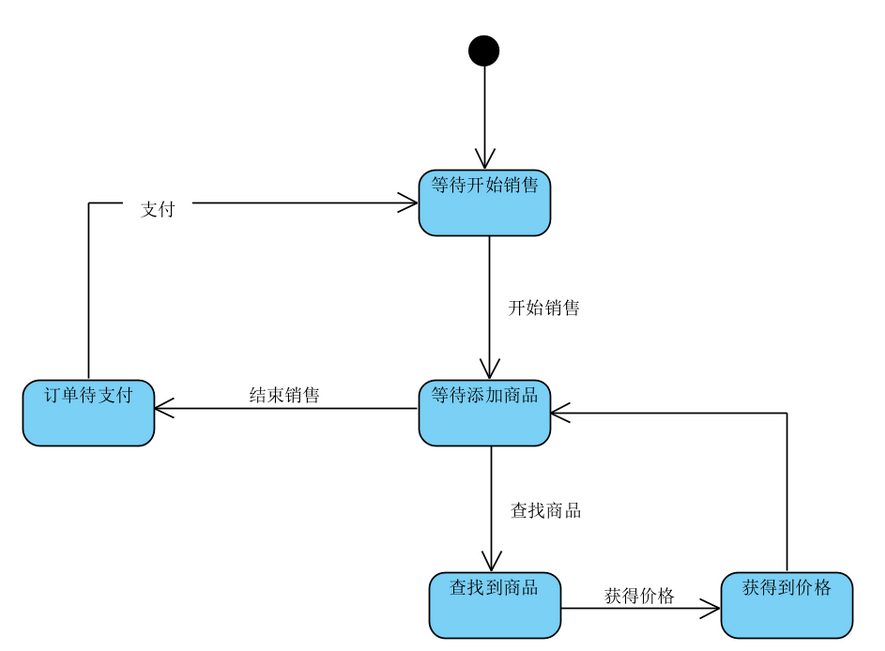
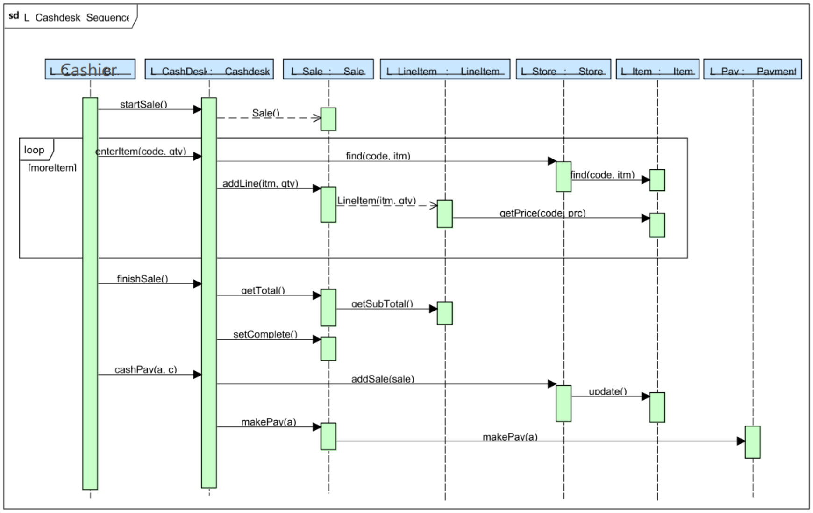
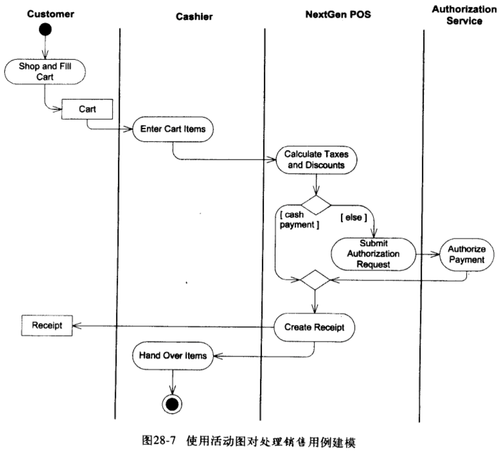

# SDD Guide

以下给出软件设计说明书中必须包含的部分。

## 软件概要设计

### 包图/组件图

方方已经完成了包图，后端就不要组件图了，前端如果可以的话可以整个组件图，但我觉得比较困难。

#### 包图

#### 组件图

### 组件顺序图（或组件状态图、组件活动图）

后端可以画几个组件顺序图和组件状态图，描述几个关键的处理过程。

前端的组件顺序图或许可以用来描述各个页面之间的切换。

#### 组件顺序图

先是用包图的形式描述了各个子系统之间的依赖，又以组件图的形式描述了各个子系统之间更详细的调用关系。那么绘制组件顺序图的目的也很简单，其实就是在系统顺序图的基础上**将整个系统拆分为子系统**，再来描述用例的过程中**参与者**与**整个系统中的各个子系统**的交互过程。

下图描述了CoCoME购物系统中“处理销售”用例的组件顺序图。与系统顺序图不同的是，这个组件顺序图将系统拆开，描述了系统内部的组件在“处理销售”用例中的协作流程。

#### 组件状态图

区别于系统状态图，组件状态机图描述了某个对象的状态和感兴趣的事件以及对象响应该事件的行为。

## 软件详细设计

后端的话设计类图、用例实现顺序图、活动图肯定都得有，应该能通过修改概要设计的图得到，用例实现顺序图和活动图的具体数量待定。

前端我不知道。

### 设计类图

到了详细设计阶段，我们需要依据之前所建立的组件模型（组件图、组件顺序图等）将整个系统的具体实现方式通过设计类图进行刻画。相较于概念类图，设计类图最显著的区别是需要写明各个类所包含的方法。此外，关联的表示方法也发生了一定的变化，具体可以参考[UML和模式应用](https://data.educoder.net/api/attachments/4824873?disposition=inline&filesize=33861269)的第182至186页。

具体见头歌。

### 顺序图（对象状态图、活动图）

#### 用例实现的顺序图

详细设计阶段，我们则需要根据刚刚绘制的设计类图，将用例描述中的系统顺序图进行细化，得到用例实现的顺序图。

原本在系统顺序图中抽象的CoCoMEProcessSale被细化为了若干个具体类，这些**类都在之前的设计类图中有出现**，而**用例实现的顺序图中的这些消息都来自于设计类图中的方法**。

一定要注意和上面的对应！

#### 用例建模的活动图

一个UML活动图表示一个过程中的多个顺序活动和并行活动。这些活动图有助于对业务过程、工作流、数据流和复杂算法进行建模。

注意区分**分叉点|连接点**和**抉择节点|合并节点**，注意区分**控制流和对象流**！！！

### 数据库 Schema 设计（标清楚主外键及满足范式情况）

陈哥我的神。